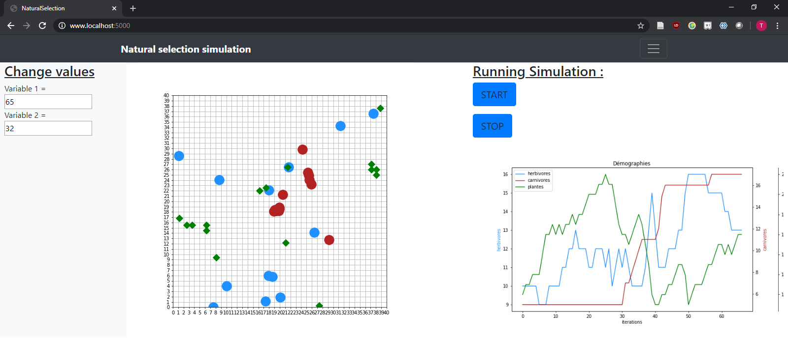

# NaturalSelection

### WIP

This project is a simple simulation of natural selection. This is a Python flask application that runs in a docker container. This project is for me a way to understand a little better how the web dev works as I currently don't know Javascript, Boostrap or html. Therefore don't judge the code too harshly.

However if you have any advice or feedback feel free to contact me.

### How it looks
<p align="center">

</p>

### TODO
- Graphical redesign using Bootstrap
- Renaming and translation
- Adding variable modification on web page
- Start fun stuff and add new features on the simulation

## How to set up the application

### Install docker
Follow the instructions here to install docker-ce https://docs.docker.com/install/linux/docker-ce/ubuntu/

After, run these commands so you do not need to use sudo to run docker
```bash
> sudo usermod -aG docker your_name
> newgrp docker
```

### Install docker-compose
```bash
> sudo curl -L https://github.com/docker/compose/releases/download/1.25.4/docker-compose-`uname -s`-`uname -m` -o /usr/local/bin/docker-compose
> sudo chmod +x /usr/local/bin/docker-compose
```

### Get the code
Clone the repository.

### Start the application
```bash
> docker-compose up --build
```
You can access the web app at: http://localhost:5000/

### (dev) Lint Code with Flake8
The flake8 linter can be run to lint the python code and enforce code quality rules (PEP8).

```bash
> docker-compose -f docker-compose.lint.yml up --build
```

